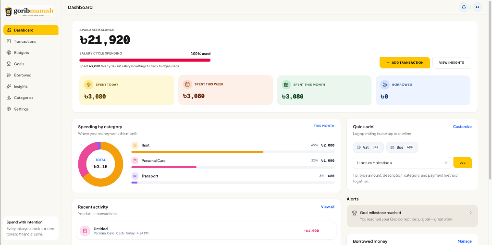
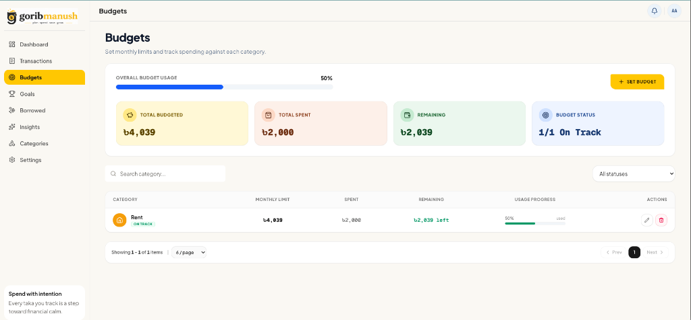
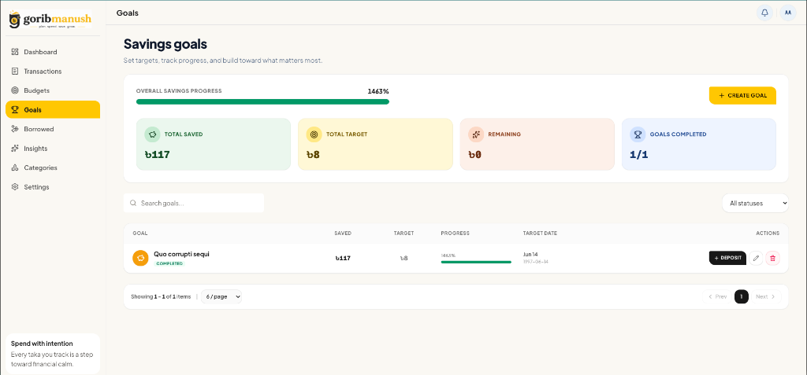
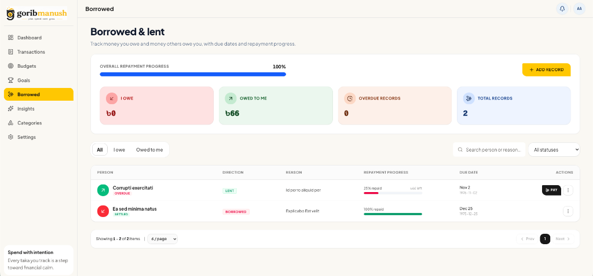
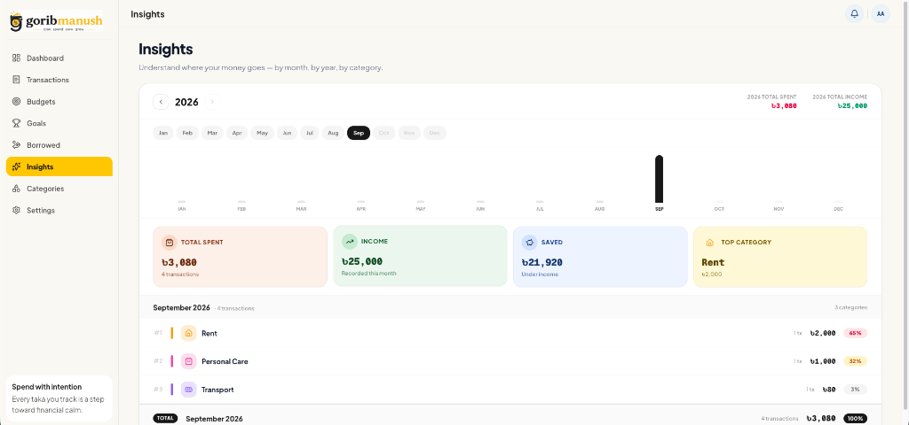

# 💰 Gorib Manush — Minimalist Expense Tracker

<div align="center">

  <p align="center">
    <strong>A modern, fast, and intentional personal finance & expense tracker built for everyday clarity.</strong>
  </p>

  <p align="center">
    <a href="https://gorib-manush.vercel.app/"><strong>🌐 View Live Demo</strong></a> •
    <a href="https://github.com/mehediScriptDev/expenses_tracker_GBM_api"><strong>⚙️ Backend API Repository</strong></a>
  </p>

  <p align="center">
    
    
    
    
    
    
  </p>
</div>

---

## 🌟 Overview

**Gorib Manush** is designed to take the stress out of managing personal finances. With a clean, warm interface and zero clutter, it empowers you to track expenses, set monthly category budgets, save toward milestones, and stay on top of borrowed or lent money effortlessly.

---

## 📸 Preview & Features

### 1. 📊 Interactive Dashboard
Get an instant overview of your available balance, salary cycle progress, daily/weekly/monthly expenses, and quick-add shortcuts.



---

### 2. 🎯 Category Budgets
Set monthly spending caps for individual categories (Rent, Food, Transport, etc.) and monitor your real-time usage with visual progress indicators.



---

### 3. 🏆 Savings Goals
Create custom savings targets with deadlines, record periodic deposits, and watch your progress reach 100%.



---

### 4. 🤝 Borrowed & Lent Records
Keep clear tabs on debts: track money you owe and money owed to you, record partial repayments, and never miss a due date.



---

### 5. 📈 Insights & Analytics
Visualize where your money goes with monthly and yearly breakdowns, income vs. expense analysis, and top spending categories.



---

## 🚀 Key Features

- **⚡ Fast Transaction Logging:** Quick-add presets and single-line command bar for one-tap logging.
- **🔐 Flexible Authentication:** Google OAuth 2.0 one-click login + standard Email/Password authentication.
- **📅 Salary Cycle Tracking:** Align your budget tracking with your actual payday cycle rather than just standard calendar months.
- **🎨 Modern UI/UX:** Built with a custom warm color palette, smooth micro-interactions, responsive mobile menus, and toast notifications.
- **🔔 Smart Notifications:** Stay informed when approaching budget thresholds or reaching goal milestones.

---

## 🛠️ Tech Stack

### Frontend
- **Framework:** [Next.js 16](https://nextjs.org/) (App Router)
- **UI & Styling:** [React 19](https://react.dev/), [Tailwind CSS v4](https://tailwindcss.com/)
- **Icons & Feedback:** [Lucide React](https://lucide.dev/), [Sonner Toasts](https://sonner.emilkowal.ski/)
- **Auth Client:** [`@react-oauth/google`](https://www.npmjs.com/package/@react-oauth/google)
- **Deployment:** [Vercel](https://vercel.com/)

### Backend ([Repository Link](https://github.com/mehediScriptDev/expenses_tracker_GBM_api))
- **Runtime:** Node.js & Express with TypeScript
- **Database & ORM:** PostgreSQL & [Prisma ORM](https://www.prisma.io/)
- **Security:** JWT (Access & Refresh Tokens), Bcrypt, Google Auth Library
- **Deployment:** [Railway](https://railway.app/)

---

## ⚙️ Getting Started (Local Development)

### 1. Clone the repository
```bash
git clone https://github.com/mehediScriptDev/expenses_tracker.git
cd expenses_tracker
```

### 2. Install dependencies
```bash
npm install
```

### 3. Setup environment variables
Create a `.env.local` file in the root directory:
```env
# Backend API URL (use http://localhost:5000 if running backend locally)
NEXT_PUBLIC_API_URL=https://expensestrackergbmapi-production.up.railway.app

# Google OAuth 2.0 Web Client ID
NEXT_PUBLIC_GOOGLE_CLIENT_ID=your-google-client-id.apps.googleusercontent.com
```

### 4. Run the development server
```bash
npm run dev
```

Open [http://localhost:3000](http://localhost:3000) in your browser.

---

## 🔗 Useful Links

- **Live Application:** [https://gorib-manush.vercel.app/](https://gorib-manush.vercel.app/)
- **Backend API Repository:** [mehediScriptDev/expenses_tracker_GBM_api](https://github.com/mehediScriptDev/expenses_tracker_GBM_api)

---

## 📄 License

This project is open source and available under the [MIT License](LICENSE).
